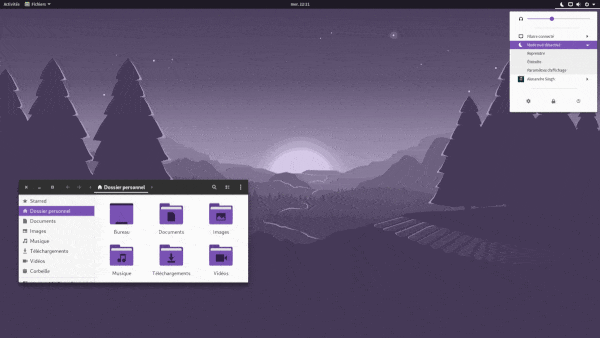

---

:information_source: **Need matching themes and wallpapers?
Check [materia-kolorizer](https://github.com/DarthWound/materia-kolorizer) and [wallpaper-kolorizer](https://github.com/DarthWound/wallpaper-kolorizer)!**

---

This bash script provides an easy way to change [Papirus icon theme](https://github.com/PapirusDevelopmentTeam/papirus-icon-theme) folders color.



-> [fullsize screenshot 1](kolorizerSC.png?raw=true) *(bootstrap purple + wp-foxy)*

-> [fullsize screenshot 2](kolorizerSK.png?raw=true) *(bulma green + wp-angly)*

## Installation

```
cd $(xdg-user-dir DOWNLOAD)
wget https://raw.githubusercontent.com/DarthWound/papirus-kolorizer/master/papirus-kolorizer.sh
chmod +x papirus-kolorizer.sh
```

You don't have to download Papirus, the script does everything for you.

If you already have this script installed, remove the old version first.

## Usage

Launch the script:

```
cd $(xdg-user-dir DOWNLOAD) && ./papirus-kolorizer.sh
```

*It will replace your existing Papirus installation if any.*

Default color is "Bootstrap purple" #7952B3 and shades. To change colors, open the script in a text editor and modify the HEX color codes in variables *(lines beginning with "readonly" at the top of the script)*. Some color codes are commented in the script to help you quickly find something you may like.

*PS: the way I change colors in Papirus is a bit dirty and hacky, but it works well and it's simple ^^*
